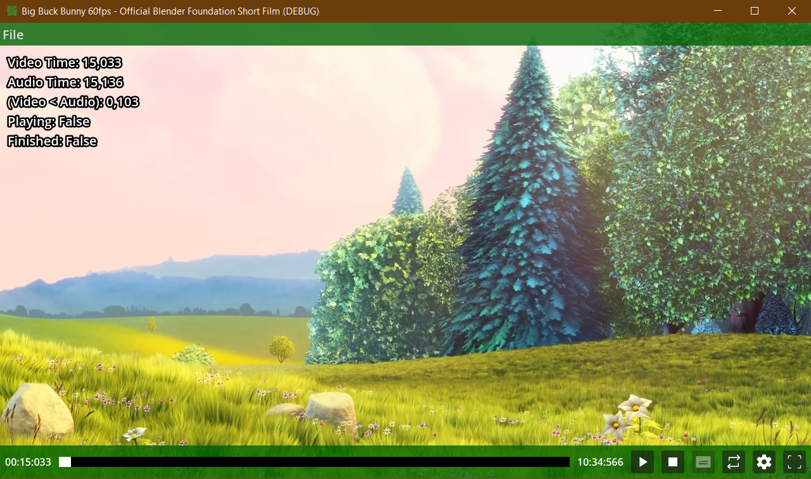
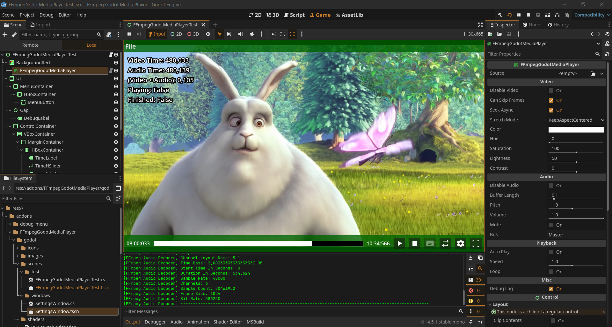

# FFmpeg Godot Media Player

This project is an addon for the Godot Engine that integrates FFmpeg to decode and playing media files (video & audio) using FFmpeg.AutoGen C#.

## Preview Images

<p align="center">
  

  
</p>

## Key Features

- Load only Video / Audio
- Skip frames
- Video seeking async
- Stretch mode
- Color, Hue, Saturation, Lightness, Contrast
- Chroma Key
- Audio buffer length
- Pitch, Volume, Mute, Bus
- Auto playing
- Playback speed
- Looping
- Debug logging
- Auto import/export media files via Godot Editor Plugin

## Limitations

- No hardware acceleration
- Right now only video files can import into the editor ("mp4", "webm", "mpg", "mpeg", "mkv", "avi", "mov", "wmv", "ogv")
- Only windows is supported at this moment

## Requirements

- FFmpeg.AutoGen.Abstractions 7.1.1 nuget package
- FFmpeg.AutoGen.Bindings.DynamicallyLoaded 7.1.1 nuget package
- Godot Engine 4.5.1 or newer
- Dotnet 8.0+

## Installation

- Make sure you install the nuget packages

```
dotnet add package FFmpeg.AutoGen.Abstractions --version 7.1.1
dotnet add package FFmpeg.AutoGen.Bindings.DynamicallyLoaded --version 7.1.1
```

- Enable AllowUnsafeBlock in csproj file

```
<AllowUnsafeBlocks>true</AllowUnsafeBlocks>
```

- Your csproj file will look like this

```
<Project Sdk="Godot.NET.Sdk/4.5.1">
  <PropertyGroup>
    <TargetFramework>net9.0</TargetFramework>
    <EnableDynamicLoading>true</EnableDynamicLoading>
    <RootNamespace>Resources</RootNamespace>
    <AllowUnsafeBlocks>true</AllowUnsafeBlocks>
    <CopyLocalLockFileAssemblies>true</CopyLocalLockFileAssemblies>
  </PropertyGroup>
  <ItemGroup>
    <PackageReference Include="FFmpeg.AutoGen.Abstractions" Version="7.1.1"/>
    <PackageReference Include="FFmpeg.AutoGen.Bindings.DynamicallyLoaded" Version="7.1.1"/>
  </ItemGroup>
</Project>
```

- Copy the `addons/FFmpegGodotMediaPlayer` folder into the root of your Godot project and build the C# code.

- Go to `Project -> Project Settings -> Plugins`, and enable the plugin.

## Usage

- See the FFmpegGodotMediaPlayerTest.tscn in the godot/test folder

## License & Attribution

The plugin itself is MIT licence, when using FFmpeg shared library LGPL, GPL will also apply to your project based on FFmpeg licence itself.

The current shared library files are using is LGPL.